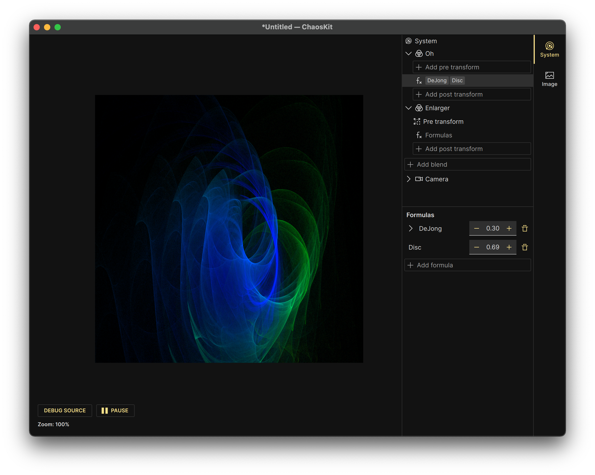

# ChaosKit

ChaosKit is a set of libraries and tools to generate pictures with [iterated function systems](https://en.wikipedia.org/wiki/Iterated_function_system). In particular, ChaosKit is inspired by [Fractal Flames](https://en.wikipedia.org/wiki/Fractal_flame) and supports generating a superset of them.



## How to build

To build ChaosKit, you need the following:

-   a C++17 compiler (Clang, GCC, maybe MSVC 2019)
-   CMake 3.6 or newer

To build the UI, you need additionally the following:

-   Qt 6.1
-   [protobuf](https://github.com/protocolbuffers/protobuf)

Once you have the above installed, you can run the following commands to download and build ChaosKit:

```
git clone https://github.com/ChaosKit/ChaosKit.git
cd ChaosKit
mkdir build
cd build
# Replace Release with Debug for a debug build.
cmake -DCMAKE_BUILD_TYPE=Release ..
make
```

## Organization

The project is organized like a [monorepo](https://en.wikipedia.org/wiki/Monorepo), mostly because it was easier for me to build it like this. There are multiple subfolders that correspond to different libraries:

-   `ast` — internal [AST](https://en.wikipedia.org/wiki/Abstract_syntax_tree) representation of function systems and helpers to define them in C++ code
-   `core` — everything you need to evaluate the AST and gather the outputs in a buffer to eventually turn into a picture
-   `flame` — utilities to build Fractal Flames and translate them into ChaosKit ASTs

*   `io` — defines the input/output format for the ChaosKit UI
*   `library` — definitions of various formulas (non-linear transformations) and coloring methods expressed in the AST
*   `state` — a standalone UI state management library, loosely inspired by [Redux](https://redux.js.org/), but turned out nothing like it. Supports compile-time validation of has-one and has-many relationships between structures.
*   `stdx` — exports `std::optional` for older Apple Clang compilers.
*   `ui` — QML-based GUI to edit and render Fractal Flames

## License

I need to formalize this one day, but this is the intent:

Code under the `ui` directory is licensed under the [GPLv3](https://www.gnu.org/licenses/gpl-3.0.html).

All other code is licensed under the [Apache 2.0 license](https://www.apache.org/licenses/LICENSE-2.0).
